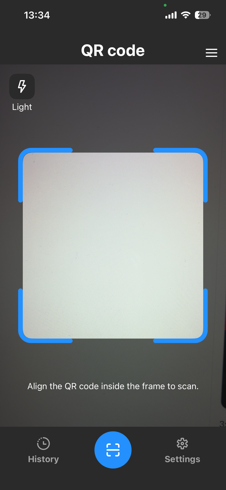
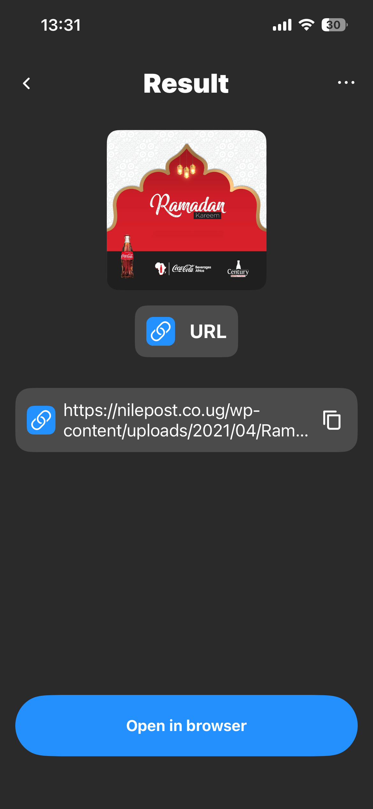
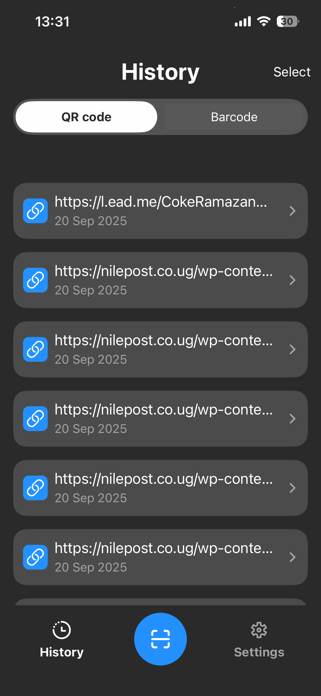
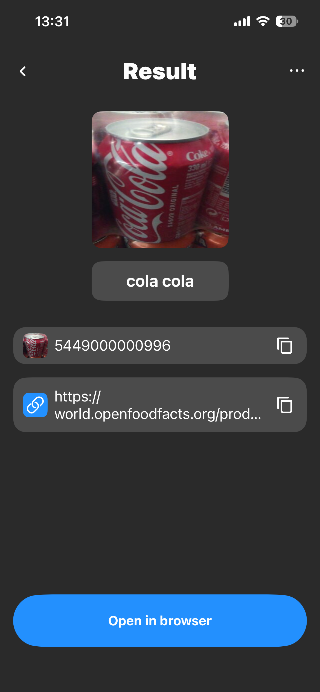
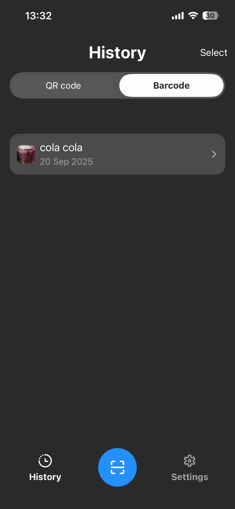

# QRScanner

**QRScanner** is an iOS app built with UIKit that scans **QR codes** and **barcodes**, saves results to history, and offers quick actions.  
For barcodes, it fetches product info from **OpenFoodFacts** (`https://world.openfoodfacts.org/product/<barcode>`).  
The app can also **generate QR codes** from text/URLs/phone numbers.

---

##  Features
- Scan **QR** and **EAN/UPC** barcodes (live camera preview)
- URL detector: open links directly
- Phone detector: call or save a number from the code
- OpenFoodFacts lookup for barcodes (product details)
- Built-in **QR code generator** (text/URL/phone)
- **History** with CoreData (re-run actions, delete items)
- Optional **paywalls/subscriptions** via Adapty

---

## 🛠 Requirements
- iOS 16.0+
- Xcode 15+
- Swift 5.9+

---

## 📦 Technologies
- **UIKit + AVFoundation** → camera capture and code decoding  
- **CoreData** → persistent scan history  
- **URLSession** → OpenFoodFacts network requests  
- **NSDataDetector** → URL & phone detection  
- **Adapty** → paywalls, subscriptions, and A/B testing  

---

## 🏗 Architecture
- **MVVM** → clear separation of UI and business logic  
- **Coordinator** → screen flow (Scanner → Result → History)  
- **Builder** → modular screen/module assembly (dependencies & wiring)  
- Services: `QRCodeService`, `BarcodeService`, `NetworkService`

---

## Permissions
Add to `Info.plist`:
- `NSCameraUsageDescription` — *Allow camera access to scan QR and barcodes.*

---

<p float="left">
  
  
  
</p>

<p float="left">
  
  
</p>


---

## Installation
1. Clone the repo:
   ```bash
   git clone https://github.com/your-username/QRScanner.git
   cd QRScanner
